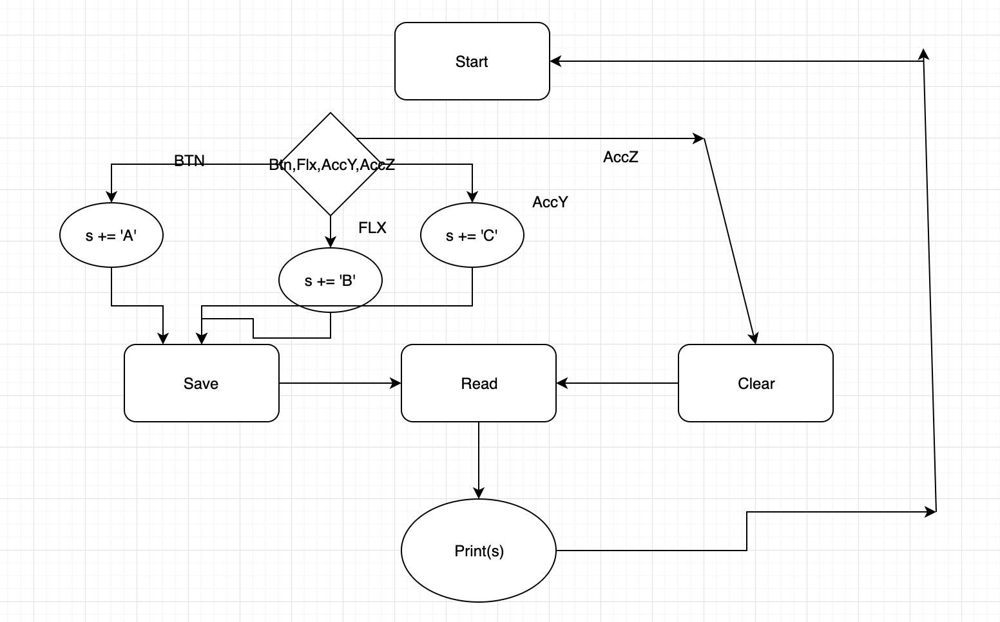

# Data Logger (and using cool sensors!)

*A lab report by John Q. Student.*

## In The Report

Include your responses to the bold questions on your own fork of [this lab report template](https://github.com/FAR-Lab/IDD-Fa18-Lab2). Include snippets of code that explain what you did. Deliverables are due next Tuesday. Post your lab reports as README.md pages on your GitHub, and post a link to that on your main class hub page.

For this lab, we will be experimenting with a variety of sensors, sending the data to the Arduino serial monitor, writing data to the EEPROM of the Arduino, and then playing the data back.

## Part A.  Writing to the Serial Monitor
 
**a. Based on the readings from the serial monitor, what is the range of the analog values being read?**

**Answer: 0-1023**
 
**b. How many bits of resolution does the analog to digital converter (ADC) on the Arduino have?**

**Answer: 10 bits, so 1024**

## Part B. RGB LED

**How might you use this with only the parts in your kit? Show us your solution.**

## Part C. Voltage Varying Sensors 
 
### 1. FSR, Flex Sensor, Photo cell, Softpot

**a. What voltage values do you see from your force sensor?**

**Answer: When not pressed: 0V, when fully pressed 5V.**

**b. What kind of relationship does the voltage have as a function of the force applied? (e.g., linear?)**

**Answer: When lightly pressing the sensor, the voltage will spike, as you apply more force it begins to level off. This has to model a logarithmic function.**

**c. Can you change the LED fading code values so that you get the full range of output voltages from the LED when using your FSR?**

**d. What resistance do you need to have in series to get a reasonable range of voltages from each sensor?** 

**Answer22k ohm did the trick.**

**e. What kind of relationship does the resistance have as a function of stimulus? (e.g., linear?)**
**Answer: The softspot and flex sensor seem to be linear, the photocell and FSR have extreme changes in resistance given small force, and follow a logarithmic trend**

### 2. Accelerometer
 
**a. Include your accelerometer read-out code in your write-up.**

[code](https://github.com/popeil97/IDD-Fa19-Lab3/blob/master/acel_rgb.ino)

## Part D. Logging values to the EEPROM and reading them back
 
### 1. Reading and writing values to the Arduino EEPROM

**a. Does it matter what actions are assigned to which state? Why?**

**Answer: Yes, you wouldn't want to do a clear before a write, they must be in logical order.**

**b. Why is the code here all in the setup() functions and not in the loop() functions?**

**Answer: reading or writing only needs to happen when data is changed, or the program has started, or specifically needs information, so it doesn't make any sense to put this logic in a loop. Additionally reading/writing can be expensive depending on the data, and may delay program.**

**c. How many byte-sized data samples can you store on the Atmega328?**

**Answer: 1024 bytes**

**d. How would you get analog data from the Arduino analog pins to be byte-sized? How about analog data from the I2C devices?**

**Answer: The analog pins on the arduino are 10 bits, while the EEPROM stores in chunks of 8 bytes. The analog signals would have to be mapped to a 8 bits, so it may take more than one byte to represent an analog signal. I2C groups data in 8 bits, and do not need to be mapped to be stored in the EEPROM**

**e. Alternately, how would we store the data if it were bigger than a byte? (hint: take a look at the [EEPROMPut](https://www.arduino.cc/en/Reference/EEPROMPut) example)**

**Answer: You would have to break up the data into multiple bytes, store them separately. Place a flage where the data starts so the program knows how many bytes to read, then combine them all after being read.**

**Upload your modified code that takes in analog values from your sensors and prints them back out to the Arduino Serial Monitor.**

[code_switch](https://github.com/popeil97/IDD-Fa19-Lab3/blob/master/SwitchState2.ino)
[code0](https://github.com/popeil97/IDD-Fa19-Lab3/blob/master/state0.ino)
[code1](https://github.com/popeil97/IDD-Fa19-Lab3/blob/master/state1.ino)
[code2](https://github.com/popeil97/IDD-Fa19-Lab3/blob/master/state2.ino)

### 2. Design your logger
 
**a. Insert here a copy of your final state diagram.**

  

### 3. Create your data logger!
 
**a. Record and upload a short demo video of your logger in action.**

I created a sensor encoder. For each sensor response, a different character is saved into the EEPROM, and printed on the LCD screen. I used the accelerometer to clear the EEPROM.

[Data Logger](https://youtu.be/KN8CFK9CE3w)
